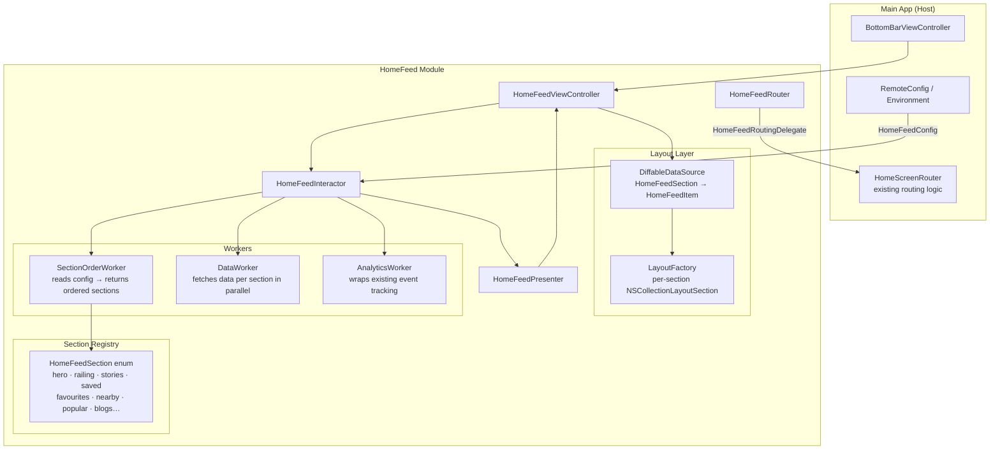
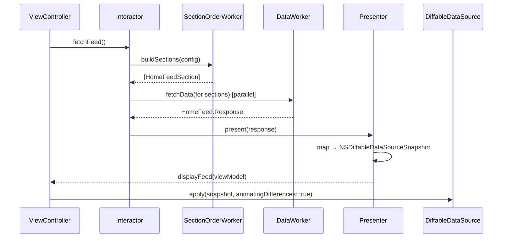
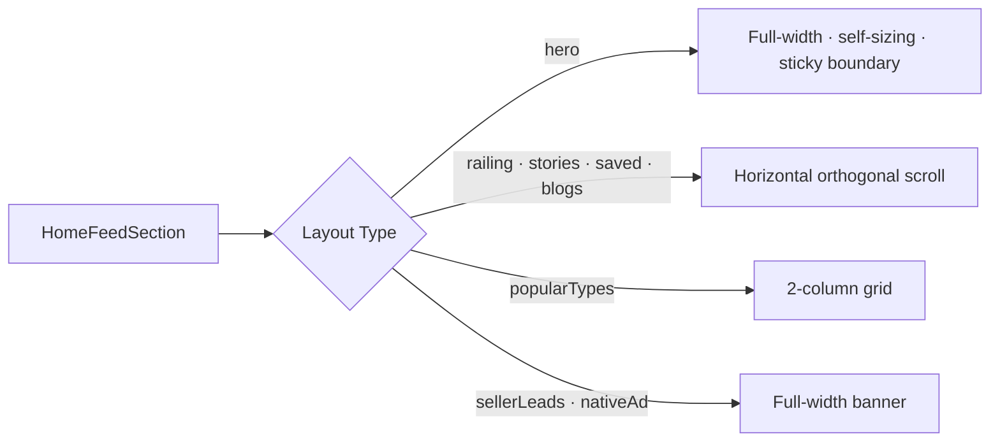
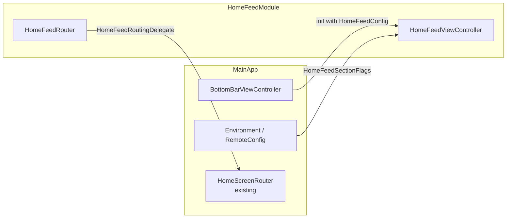

# ios-bayut-home
# Home Feed Revamp — Tech Spec
**Dynamic Compositional Feed · Independent Module · VIP Architecture**

---

## 1. Goal

Replace the legacy `NewHomeScreenViewController` (a 1,357-line monolith backed by XIB + nested `UIStackView`s) with a **self-contained `HomeFeed` module** built on `UICollectionViewCompositionalLayout` and a config-driven section model.

The result is a feed that is:
- **Dynamic** — section order and visibility driven by a single config, not hardcoded XML
- **Scalable** — adding a new section is a 1-file change
- **Independent** — the module owns its own VIP stack, layout, and cells; the main app only provides a config and a router delegate

---

## 2. The Problem

| Pain Point | Impact |
|---|---|
| 40+ `@IBOutlet` connections to a XIB | Silent crashes on storyboard/XIB changes |
| Sections hardcoded in `UIStackView` order | Adding/reordering requires XIB edits + segue + container VC |
| `isHidden` toggling for feature flags | All sections allocated in memory even when invisible |
| 15+ `NSLayoutConstraint` mutations per scroll frame | Poor scroll performance, fragile math |
| Remote config checks spread across 10+ methods in `viewDidLoad` | No single source of truth for what renders |
| Child VCs wired via Storyboard segues | Module is inseparable from the main app storyboard |

---

## 3. What We're Building

A **`HomeFeed` module** that receives a configuration object from the host app and renders a fully dynamic, diffable collection view. The host app does not know about cells, sections, or layout — it only hands off a config and implements a routing delegate.



### Clear Boundary Contract

```swift
// ─── What the Main App provides ───────────────────────────────────────────

protocol HomeFeedRoutingDelegate: AnyObject {
    func homeFeed(didRequestSearch filter: Filter)
    func homeFeed(didSelectProperty property: VProperty)
    func homeFeed(didSelectBlog url: String)
    func homeFeed(didRequestRoute destination: HomeFeedDestination)
}

struct HomeFeedConfig {
    let sectionFlags: HomeFeedSectionFlags    // wraps all remote config flags
    let initialPurpose: VProperty.Purpose
    let routingDelegate: HomeFeedRoutingDelegate
}

// ─── What the Main App receives ────────────────────────────────────────────

// A single UIViewController — plug it in, done.
let homeFeedVC = HomeFeedViewController.make(config: config)
```

The main app provides **config in, routing delegate out**. It never touches a cell, a section, or a layout.

---

## 4. Architecture Inside the Module

### 4.1 VIP Data Flow



### 4.2 The Section Model — Single Source of Truth

```swift
enum HomeFeedSection: Hashable {
    case hero
    case railing
    case stories
    case recentSearches
    case savedSearches
    case browseProjects
    case favourites
    case nearbyLocations
    case popularTypes
    case sellerLeadsBanner
    case nativeAd
    case blogs
    case carouselBanners
    // Future: just add a case here
}
```

The `SectionOrderWorker` reads `HomeFeedConfig` and returns a plain `[HomeFeedSection]`. This is the **only place** that decides what renders and in what order.

```swift
// Before (legacy) — scattered across viewDidLoad:
if Environment.valueFor(key: .homeRailingEnabled) { homeRailingStackView?.isHidden = false }
if Environment.valueFor(key: .isStoriesEnabled)   { storiesWidgetView.isHidden = false }
// … 8 more blocks

// After — one function, one output:
func buildSections(config: HomeFeedConfig) -> [HomeFeedSection] {
    var sections: [HomeFeedSection] = [.hero]
    if config.flags.isRailingEnabled    { sections.append(.railing) }
    if config.flags.isStoriesEnabled    { sections.append(.stories) }
    if config.flags.isRecentSearches    { sections.append(.recentSearches) }
    sections.append(contentsOf: [.savedSearches, .favourites, .nearbyLocations, .popularTypes, .blogs])
    return sections
}
```

### 4.3 Layout Factory — One Section, One Layout



Each layout is built independently inside `HomeFeedLayoutFactory`. The collection view calls the factory per section index — no layout logic lives in the ViewController.

---

## 5. Benefits

### 5.1 Developer Experience

| | Legacy | HomeFeed Module |
|---|---|---|
| **Add a new section** | XIB edit + new container view + Storyboard segue + child VC + delegate wiring | Add 1 enum case + 1 cell file |
| **Reorder sections** | Drag views in XIB, fix auto-layout | Change array order in `buildSections()` |
| **Feature-flag a section** | Add `isHidden = true` in 2–3 places | Exclude from `[HomeFeedSection]` |
| **Fix a section's layout** | Constrained by XIB + parent stack spacing | Edit one `NSCollectionLayoutSection` builder |
| **Add iPad-specific sizing** | Manual margin delegation callbacks | `NSCollectionLayoutEnvironment.traitCollection` in layout factory |
| **ViewController size** | 1,357 lines | < 200 lines |
| **IBOutlets** | 40+ | 0 |

### 5.2 Runtime Performance

| | Legacy | HomeFeed Module |
|---|---|---|
| **Scroll performance** | 15 `NSLayoutConstraint` mutations per frame | Zero — cells self-size, layout engine handles it |
| **Memory** | All container VCs allocated even when section is hidden | Only visible cells are in memory (collection view recycling) |
| **Section updates** | Manual `isHidden` + `layoutIfNeeded` + animate manually | `dataSource.apply(snapshot)` — diffable, animated, batched |

### 5.3 Maintainability

- **No XIB/Storyboard dependency** — the module is pure Swift, instantiated programmatically
- **No child VC delegation hell** — section data flows through the VIP stack, not through 6 child VC delegates
- **Remote config centralized** — one config struct, one worker, one output. Any engineer can read `buildSections()` and know exactly what will render
- **Cells are independent** — each cell takes a typed view model and knows nothing about the parent VC or other sections

### 5.4 Testability

| Layer | How it's tested |
|---|---|
| `SectionOrderWorker` | Unit test with a mock `HomeFeedConfig` — no UIKit needed |
| `HomeFeedInteractor` | Unit test with mock workers and a mock presenter |
| `HomeFeedPresenter` | Pass a `Response`, assert the resulting `Snapshot` sections and items |
| Cells | Snapshot tests with a typed view model |
| Integration with main app | `HomeFeedRoutingDelegate` mock — assert the right route was triggered |

### 5.5 Future-Proofing

Because the feed is config-driven and the module has clean boundaries:
- **Server-driven feed order** — the backend can eventually dictate `[HomeFeedSection]` directly; no client changes needed
- **Personalisation** — user-specific section ordering is a `buildSections()` input, not a VC refactor
- **Multi-target reuse** — the `HomeFeed` module can be shared across UAE, KSA, Egypt targets with different `HomeFeedConfig` inputs

---

## 6. Integration With the Main App



1. `BottomBarViewController` creates `HomeFeedViewController.make(config:)` — exactly as it does today for `NewHomeScreenViewController`
2. `HomeFeedConfig.sectionFlags` wraps all `Environment.valueFor(key:)` calls — the module never imports `Environment` directly
3. All navigation goes through `HomeFeedRoutingDelegate` — implemented by the existing `HomeScreenRouter`, so zero routing logic is duplicated
4. Analytics — `HomeFeedAnalyticsWorker` wraps the existing `AnalyticsManager.instance.track()` calls; event schema is unchanged

---

## 7. Rollout Plan

The new module ships behind a remote config flag. Both the old and new ViewControllers coexist with zero risk until QA sign-off.

```
Phase 1 · Foundation      HomeFeedSection enum · LayoutFactory · cell scaffolds
Phase 2 · VIP Wiring      Interactor → SectionOrderWorker → Presenter → DiffableDataSource
Phase 3 · Sections         Migrate all sections one by one, behind the flag
Phase 4 · Integration      HomeFeedRoutingDelegate wiring · analytics audit · iPad + RTL
Phase 5 · Cleanup          Remove legacy NewHomeScreenViewController and storyboard references
```
