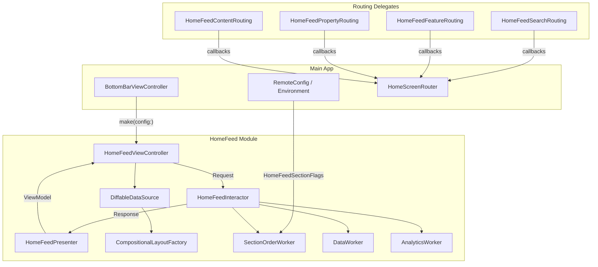
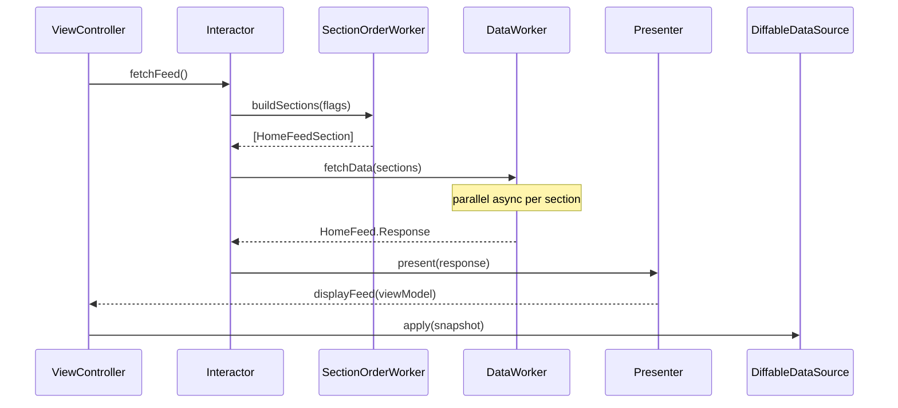
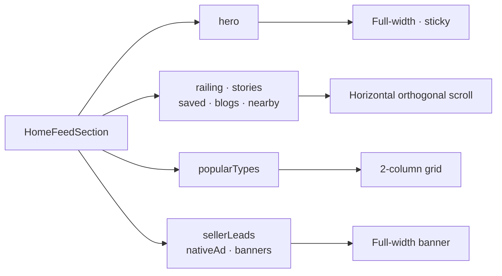
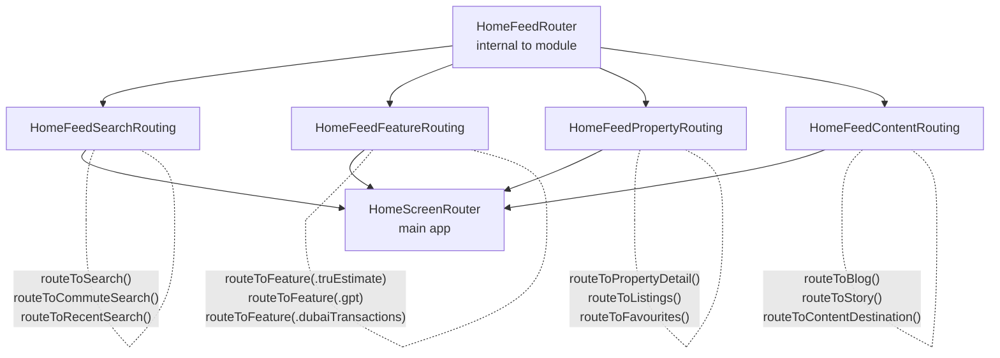
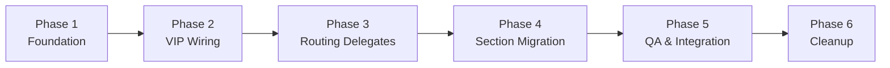

# HomeFeed Module — Tech Spec
**Dynamic Compositional Feed · Independent Module · Segregated Routing · VIP Architecture**

---

## 1. Goal

Replace the legacy `NewHomeScreenViewController` — a 1,357-line monolith coupled to a Storyboard XIB and nested `UIStackView`s — with a self-contained **HomeFeed** module built on `UICollectionViewCompositionalLayout` and a config-driven section model.

The HomeFeed module is:
- **Dynamic** — section order and visibility driven by a single configuration, not hardcoded XML
- **Scalable** — adding a new section requires one enum case and one cell file
- **Self-contained** — the host app never touches cells, layout, or sections
- **Independently navigable** — routing split into four focused, single-responsibility delegates

---

## 2. The Problem

| Pain Point | Impact |
|---|---|
| 40+ `@IBOutlet` connections to a XIB | Silent crashes on any storyboard/XIB change |
| Sections hardcoded in `UIStackView` order | Adding or reordering requires XIB edit + segue + child VC + delegate wiring |
| `isHidden` toggling for feature flags | All sections allocated in memory even when not visible |
| 15+ `NSLayoutConstraint` mutations per scroll frame | Poor scroll performance; fragile offset arithmetic |
| Remote config logic scattered across 10+ methods | No single source of truth for what the feed renders |
| All navigation in one 968-line `HomeScreenRouter` | Any routing change requires understanding the entire router |
| Child VCs wired via Storyboard segues | Module inseparable from the main app storyboard |

---

## 3. Module Overview

The HomeFeed module is a **plugin** to the main app. It accepts a typed config on creation and communicates back only through narrow, focused routing protocols.

> **Rule:** The main app owns navigation. The HomeFeed module owns rendering.



### Contract

| Direction | What is exchanged |
|---|---|
| **Main App → HomeFeed** | `HomeFeedConfig` (section flags, initial purpose, four routing delegates) |
| **HomeFeed → Main App** | Routing delegate callbacks only. Analytics via existing `AnalyticsManager`. No UIKit references back. |

```swift
struct HomeFeedConfig {
    let sectionFlags: HomeFeedSectionFlags
    let initialPurpose: VProperty.Purpose
    let searchRouting: HomeFeedSearchRouting
    let featureRouting: HomeFeedFeatureRouting
    let propertyRouting: HomeFeedPropertyRouting
    let contentRouting: HomeFeedContentRouting
}

// Host hands off one VC — nothing else needed
let feedVC = HomeFeedViewController.make(config: config)
```

---

## 4. Internal Architecture

### 4.1 VIP Data Flow



### 4.2 The Section Model

```swift
enum HomeFeedSection: Hashable {
    case hero               // sticky search bar + purpose tabs
    case railing            // horizontal feature shortcut cards
    case stories            // agent stories rail
    case recentSearches     // recent / last search cards
    case savedSearches      // user's saved searches
    case browseProjects     // new projects rail
    case favourites         // saved property cards
    case nearbyLocations    // location-based property cards
    case popularTypes       // 2-column property type grid
    case sellerLeadsBanner  // full-width CTA banner
    case nativeAd           // full-width ad unit (market-specific)
    case blogs              // editorial content cards
    case carouselBanners    // event / workshop banners
    // New section = add one case here. Nothing else changes.
}
```

### 4.3 Section Ordering — Single Source of Truth

```swift
// Before — 10+ scattered isHidden blocks in viewDidLoad:
if Environment.valueFor(key: .homeRailingEnabled) { homeRailingStackView?.isHidden = false }
if Environment.valueFor(key: .isStoriesEnabled)   { storiesWidgetView.isHidden = false }
// … no single readable output

// After — one function, one return value:
func buildSections(flags: HomeFeedSectionFlags) -> [HomeFeedSection] {
    var sections: [HomeFeedSection] = [.hero]
    if flags.isRailingEnabled   { sections.append(.railing) }
    if flags.isStoriesEnabled   { sections.append(.stories) }
    if flags.showRecentSearches { sections.append(.recentSearches) }
    sections += [.savedSearches, .favourites, .nearbyLocations, .popularTypes, .blogs]
    return sections
    // Reorder = move one line.  Remove a section = delete one line.
}
```

### 4.4 Layout per Section Type



---

## 5. Routing & Navigation Boundaries

A single monolithic routing delegate becomes hard to mock, test, and extend. HomeFeed instead uses **four focused protocols** — one per domain — following the **Interface Segregation Principle**.

### 5.1 The Four Delegates



### 5.2 Protocol Definitions

```swift
// Search — anything that begins a search intent
protocol HomeFeedSearchRouting: AnyObject {
    func routeToSearch()
    func routeToCommuteSearch()
    func routeToRecentSearch(filter: Filter, sorting: Sorting)
}

// Feature — standalone product surfaces via railing or entry points
protocol HomeFeedFeatureRouting: AnyObject {
    func routeToFeature(_ feature: HomeFeedFeature)
}
// HomeFeedFeature: .truEstimate · .dubaiTransactions · .gpt
//                  .findAgent   · .dailyRental       · .mapView · .notifications

// Property — listings, detail pages, saved collections
protocol HomeFeedPropertyRouting: AnyObject {
    func routeToPropertyDetail(id: String)
    func routeToListings(filter: Filter, context: HomeFeedListingsContext)
    func routeToFavourites()
    func routeToSavedSearches()
}

// Content — editorial, media, banners, ads
protocol HomeFeedContentRouting: AnyObject {
    func routeToBlog(url: String)
    func routeToStory(storyID: String)
    func routeToContentDestination(_ destination: HomeFeedContentDestination)
}
```

### 5.3 Action → Delegate Mapping

| User Action | Delegate | Navigation |
|---|---|---|
| Tap search bar / location field | `SearchRouting` | Present |
| Tap recent / last search card | `SearchRouting` | Push |
| Tap commute search in railing | `SearchRouting` | Present |
| Tap TruEstimate in railing | `FeatureRouting` | Push / Tab Switch |
| Tap Dubai Transactions in railing | `FeatureRouting` | Push |
| Tap BayutGPT in railing | `FeatureRouting` | Push |
| Tap Find Agent in railing | `FeatureRouting` | Push |
| Tap Notification bell | `FeatureRouting` | Push |
| Tap Map View in railing | `FeatureRouting` | Tab Switch |
| Tap a favourite property | `PropertyRouting` | Push |
| View All Favourites | `PropertyRouting` | Push / Tab Switch |
| Tap a saved search | `PropertyRouting` | Push |
| Tap a nearby location | `PropertyRouting` | Push |
| Tap a popular property type | `PropertyRouting` | Push |
| Tap a blog article | `ContentRouting` | Push |
| Tap an agent story | `ContentRouting` | Present Fullscreen |
| Tap native ad / event banner | `ContentRouting` | Push |
| Tap seller leads banner | `ContentRouting` | Present |

---

## 6. Benefits

### 6.1 Developer Experience

| Task | Legacy | HomeFeed Module |
|---|---|---|
| Add a new section | XIB + segue + container VC + delegate wiring | 1 enum case + 1 cell file |
| Reorder sections | Drag views in XIB, fix Auto Layout | Move one line in `buildSections()` |
| Feature-flag a section | `isHidden` in multiple places | Exclude from `[HomeFeedSection]` |
| Add a routing destination | Modify 968-line `HomeScreenRouter` | Add one method to one focused delegate |
| iPad-specific sizing | Manual margin callbacks across child VCs | `NSCollectionLayoutEnvironment` in factory |
| ViewController size | 1,357 lines | < 200 lines |
| `@IBOutlet` count | 40+ | Zero |

### 6.2 Runtime Performance

| Metric | Legacy | HomeFeed Module |
|---|---|---|
| Scroll performance | 15+ `NSLayoutConstraint` mutations per scroll frame | Zero — layout engine handles it natively |
| Memory footprint | All child VCs allocated even when section is hidden | Only visible cells held in memory |
| Section updates | Manual `isHidden` + `layoutIfNeeded` + custom animation | `dataSource.apply(snapshot)` — diffable and batched |

### 6.3 Maintainability

- **No XIB/Storyboard dependency** — pure Swift, fully programmatic
- **No child VC delegation chains** — section data flows through VIP, not 6 child delegates
- **Centralised remote config** — one `buildSections()` call; any engineer can read exactly what renders
- **Segregated routing** — 4 focused delegates instead of 1 monolith; each independently mockable
- **Independent cells** — each cell takes a typed view model with no knowledge of parent or sibling sections

### 6.4 Testability

| Layer | Approach |
|---|---|
| `SectionOrderWorker` | Unit test with mock `HomeFeedSectionFlags` — zero UIKit |
| `HomeFeedInteractor` | Unit test with mock workers + mock presenter |
| `HomeFeedPresenter` | Assert snapshot sections and items from a given `Response` |
| Routing | Mock each of the 4 delegates independently — no need to stub the full router |
| Cells | Snapshot tests driven by a typed view model |

### 6.5 Future-Proofing

- **Server-driven feed** — backend can return `[HomeFeedSection]` order; zero client changes needed
- **Personalisation** — user-specific ordering is a `buildSections()` input, not a VC refactor
- **Multi-target reuse** — UAE, KSA, Egypt share the module with different `HomeFeedConfig`
- **Routing extensibility** — new feature = one method on one small focused protocol

---

## 7. Rollout Plan

> The HomeFeed module ships behind a remote config flag. Old and new ViewControllers coexist at zero production risk until full QA sign-off.



| Phase | Goal |
|---|---|
| **1 — Foundation** | `HomeFeedSection` enum · `CompositionalLayoutFactory` · empty cell scaffolds |
| **2 — VIP Wiring** | Interactor → `SectionOrderWorker` → Presenter → DiffableDataSource, end-to-end |
| **3 — Routing Delegates** | Implement all 4 protocols; wire into existing `HomeScreenRouter` |
| **4 — Section Migration** | Migrate all 13 sections one by one behind the remote config flag |
| **5 — QA & Integration** | iPad + RTL · analytics audit · deep link verification |
| **6 — Cleanup** | Delete `NewHomeScreenViewController`, Storyboard XIB, all dead `@IBOutlet`s |
